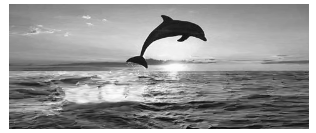
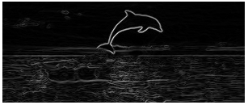
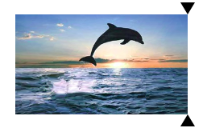

# seam_carving
Seam carving is a content aware image resizing algorithm which aims to
preserve high energy portions of the image. Unlike cropping, which
linearly removes outer portions of the image, seam carving seeks to
remove the lowest energy path. To determine the path with the lowest
energy, the image's gradient must be calculated which reveals the
energy of each pixel. Afterwards the lowest energy path is calculated
through dynamic programming and removed from the image.

## Conversion to greyscale
To convert an image to greyscale, all RGB values of a pixel must be averaged out to be the same value

## Calculating image gradient
To calculate the image gradient of a pixel the difference between the immediate surrounding pixels is put into a distance formula to calculate that pixels contrast

## Carving a seam
After the image gradient is calculated, the lowest energy path down the image is calculated through dynamic programming to reduce the time complexity. Afterwards, the image is redrawn.

